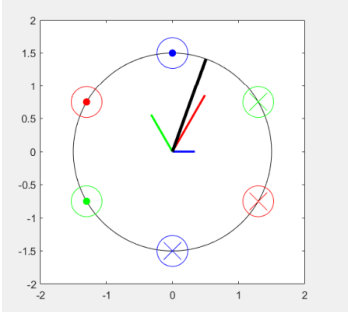

# P-Pole_Magnetic_Field_Intensity_Vectors_Animation

This project is written as a final project of the course "EE304 Energy Conversions". The project aims to generate the animation of magnetic field intensity vectors created by p-pole stator. 

The number of the poles desired could be stated in the "pole" variable of the MATLAB script. The resultant animation not only shows the generated magnetic field intensity vectors created by the coils but also the corresponding current directions.

##Examples

